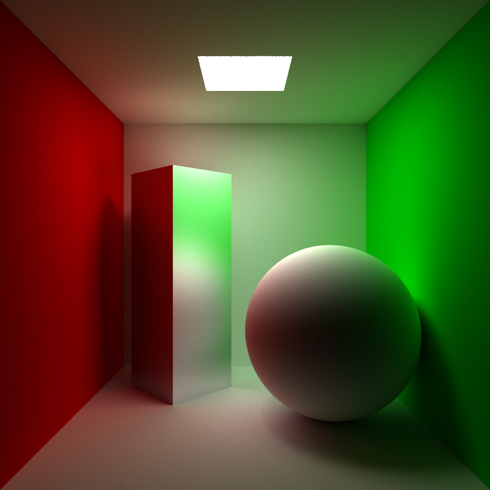
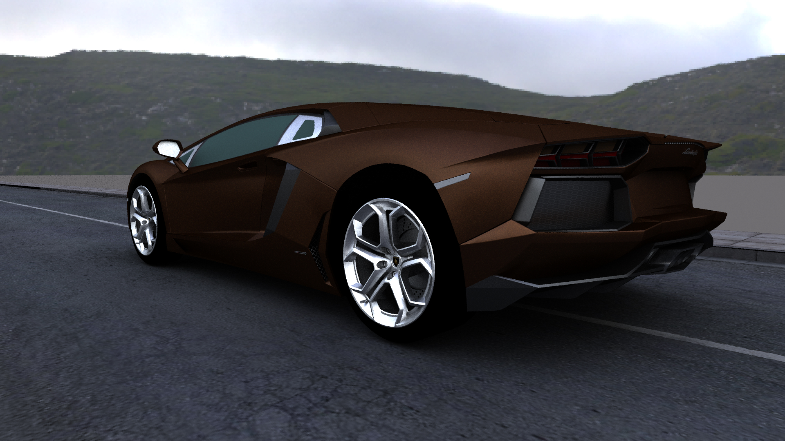
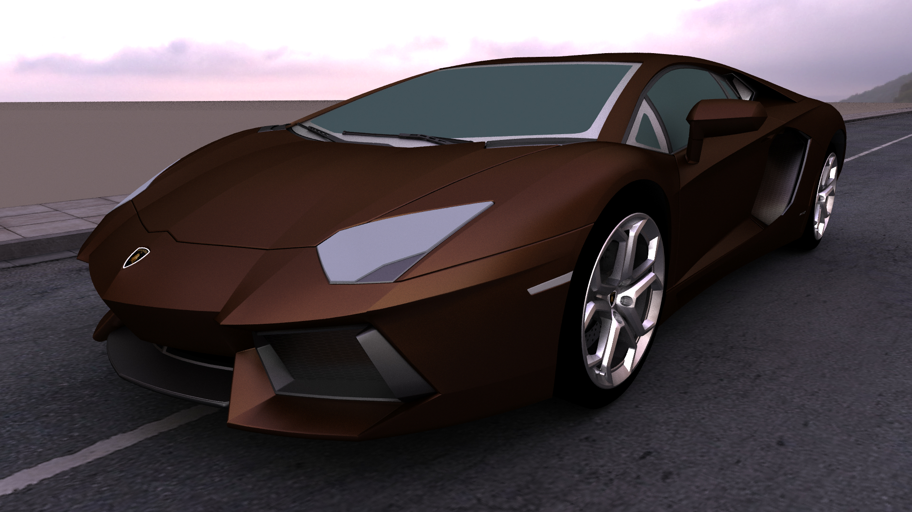
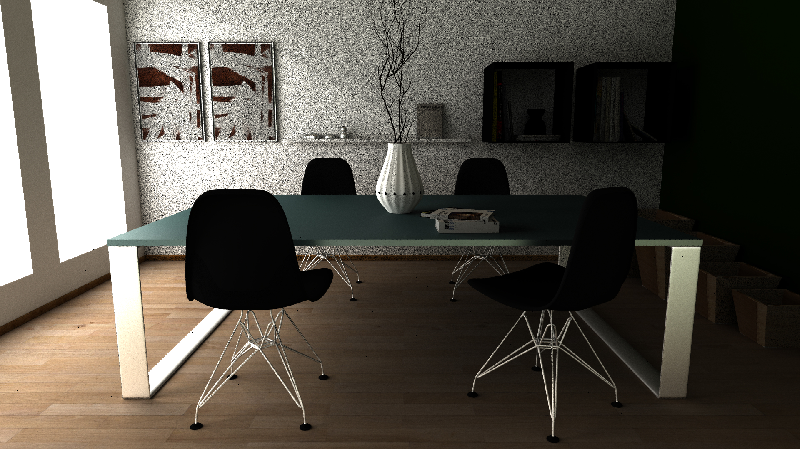
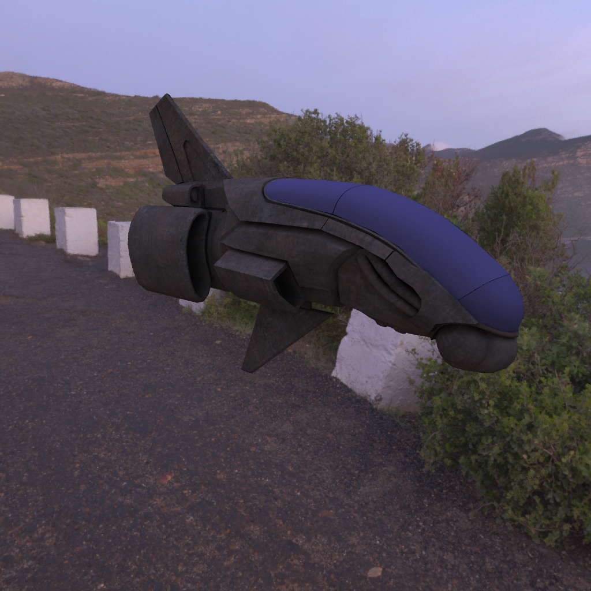

# MCPT1
Self implemented Path Tracer

# Platform
Ubuntu 20.04(Linux)

# Thrid party dependency:
1. GLM

# Compile
1. g++ *.cpp -o mcpt(executable name) -I tinyobjloader_x64-linux/include/ -fopnmp(optional)

# Run
1. Config a scene file(see scene_*.txt, the format is self-explainary)
2. ./mcpt scene_name.txt

# Code not written by myself
1. tinyobjloader: load triangle meshes
2. stb_image.h: read image files(include textures and environment maps)
3. stb_image_write.h: save rendered results as .jpg
4. KDTree.h/cpp: KD-Tree i stole from pbr-book's github

# Features:
A relatively complete Monte Carlo Path Tracer include:
1. Importance sampling according to BRDF [Material.h/cpp]
2. Use Russian Roulette to terminate the tracing [PathTracer.h]
3. I also tried to represent environment map with spherical harmonic lighting [EnvMap.h/cpp]

# Here's some results:
# Box(1024x1024, 16xSS, 400 rays per subpixel)

# Car1(1920x1080, 16xSS, 100 rays per subpixel)

# Car2(1920x1080, 9xSS, 100 rays per subpixel)

# Dining(1920x1080, 9xSS, 100 rays per subpixel)

# Spaceship(1024x1024, 4xSS, 40 rays per subpixel)
